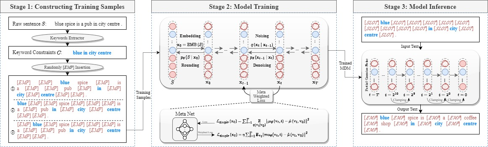

#  MDM: Meta Diffusion Model for Domain-Specific Hard-Constrained Text Generation  



<p align = "center">

</p>
<p align = "center">
The framework of our proposed model MDM.
</p>

<p align = "center">

</p>
<p align = "center">

</p>

## Setup:
```bash 
pip install -r requirements.txt 
```

## MDM Training
```bash
cd scripts
bash train.sh
```
Arguments explanation:
- ```--dataset```: the name of datasets, just for notation
- ```--data_dir```: the path to the saved datasets folder, containing ```train.jsonl,meta.jsonl,test.jsonl,valid.jsonl```
- ```--seq_len```: the max length of sequence
- ```--resume_checkpoint```: if not none, restore this checkpoint and continue training
- ```--vocab```: the tokenizer is initialized using bert or load your own preprocessed vocab dictionary (e.g. using BPE)

```
python -m torch.distributed.launch --nproc_per_node=4 --master_port=12233 --use_env run_train.py --diff_steps 2000 --lr 0.0001 --learning_steps 40000 --save_interval 10000 --seed 102 --noise_schedule sqrt --hidden_dim 128 --bsz 512 --dataset obw --data_dir {datasets/obw} --vocab bert --seq_len 128 --schedule_sampler lossaware --notes obw

python -m torch.distributed.launch --nproc_per_node=4 --master_port=12233 --use_env run_train.py --diff_steps 2000 --lr 0.0001 --learning_steps 60000 --save_interval 2000 --seed 102 --noise_schedule sqrt --hidden_dim 128 --bsz 512 --microbatch 64 --dataset e2e --data_dir {datasets/e2e} --vocab bert --seq_len 128 --schedule_sampler lossaware --notes e2e

python -m torch.distributed.launch --nproc_per_node=7 --master_port=12233 --use_env run_train.py --diff_steps 2000 --lr 0.0001 --learning_steps 60000 --save_interval 20000 --seed 102 --noise_schedule sqrt --hidden_dim 128 --bsz 512 --microbatch 64 --dataset conll --data_dir {datasets/conll} --vocab bert --seq_len 128 --schedule_sampler lossaware --notes conll
```


## MDM Inference
You need to modify the path to ```model_dir```, which is obtained in the training stage.
```bash
cd scripts
bash run_decode.sh
```